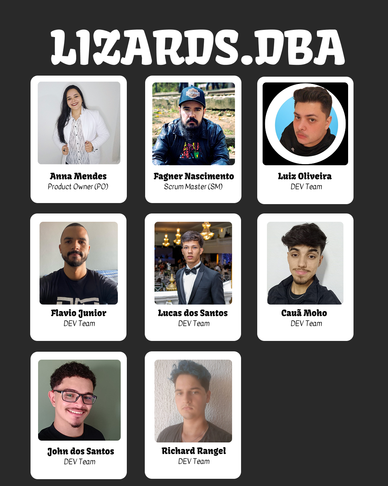

<!DOCTYPE html>
<html lang="pt-br">
<head>
    <meta charset="UTF-8">
    <meta name="viewport" content="width=device-width, initial-scale=1.0">
</head>
<body>

Somos estudantes do 1º semestre do curso de Banco de Dados na FATEC SJC, estamos dedicados ao desenvolvimento de 6 projetos ao longo do nosso curso..

## Índice

♦ [Integrantes do projeto](#integrantes-do-projeto)  
♦ [Boas práticas](#boas-práticas)  
♦ [Contato](#contato)  

## Integrantes do projeto
  

  

 ## Boas práticas

 1. Sempre nomeie arquivos, funções ou funcionalidades utilizando camelCase é uma convenção de nomenclatura, onde as palavras são unidas sem espaços e cada palavra subsequente é capitalizada, exceto a primeira, como por exemplo o próprio nome da convenção: camelCase.
 2. Ao dar nome aos arquivos, funções ou ao fazer os commits, faça em inglês para exercitar o idioma e também é amplamente aceito como a língua padrão na indústria de tecnologia e programação. Usar nomes em inglês ajuda a manter a consistência e a interoperabilidade entre diferentes projetos e equipes ao redor do mundo.
 3. Ao realizar os commits utilize o pradrão: emoji + tipo do commit + breve descrição do que foi feito, se tiver dúvidas, dê uma olhada no repositório: 
[**Padrões de Commits**](https://github.com/arafaellacruz/padroes-de-commits)

## Contato

Se você tiver alguma dúvida, sugestão ou apenas quiser trocar uma ideia, sinta-se à vontade para me enviar um e-mail em [lizardsdba@gmail.com](mailto:lizardsdba@gmail.com). 
Estamos ansiosos para ouvir de você!
    
